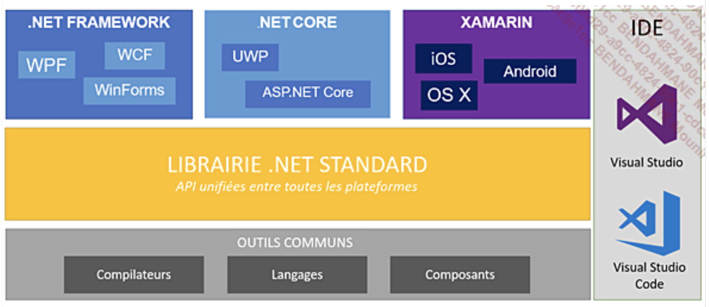
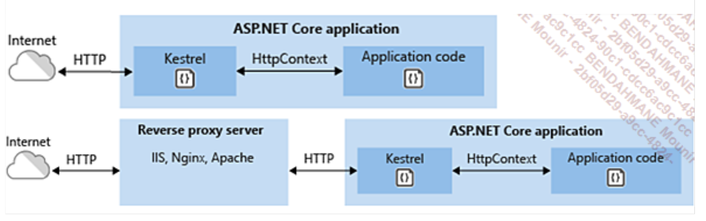
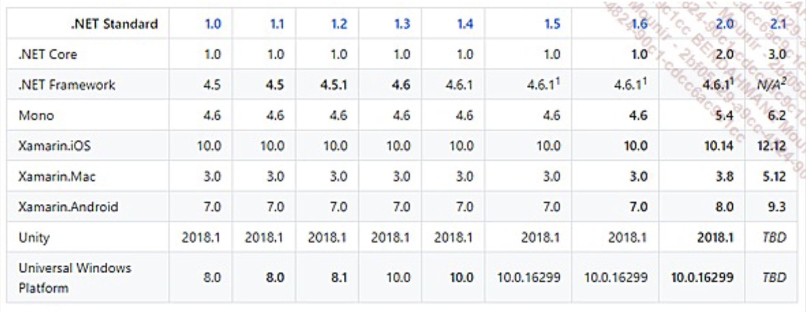

# ISITECH B3 RPI D - .NET

## Prérequis

Avoir installé .NET Core 8.0 ou supérieur :

```bash
dotnet --version // la  version la plus recente installée

dotnet --list-sdks // liste des SDK installés
```

## Cours

.NET est un framework de developpement cross-platform et open-source concu par Microsoft.

Voici un apperçu des technologies .NET:



La premiere difference entre .NET et .NET Core est que .NET Core est open-source et cross-platform, tandis que .NET Framework est proprietaire et ne fonctionne que sur Windows.

La portabilite de .NET Core est possible car il ne depend pas de Windows, mais de CoreCLR, une version de CLR (Common Language Runtime) qui est cross-platform.

Les librairies NuGet : .NET Core utilise les librairies NuGet, qui sont des librairies open-source, tandis que .NET Framework utilise les librairies proprietaires de Microsoft.
Cependant toutes les librairies .NET Framework ne sont pas encore portees sur .NET Core.

## Le pattern MVC

.NET utilise le pattern MVC (Model-View-Controller) pour developper des applications web:

- Separation des couches logiques, metier et presentation
- Razor Pages permet de creer des pages Web
- du Model Binding et de la validation de Model

Voici l'architecture d'un projet .NET console (cf projet), pour en creer une il suffit de taper la commande suivante :

```bash
dotnet new console

```

On remarque que le contenu du code source est alors constituee d'une seule ligne dans le fichier Program.cs :

```csharp
Console.WriteLine("Hello World!");
```

Si on veut obtenir un programme avec l'ancienne syntaxe, il suffit de taper la commande suivante :

```bash
dotnet new console --use-program-main

 dotnet new console --use-program-main -o consoleProject
```

Pour lancer le programme, il suffit de taper la commande suivante :

```bash
dotnet run
```

Le cli dotnet vous fournit toutes les commandes necessaires pour creer, compiler, executer et publier des projets .NET. :

- dotnet new : initialise un nouveau projet
- dotnet restore : restaure les packages
- dotnet build : compile le projet
- dotnet run : execute le projet
- dotnet test : execute les tests unitaires
- dotnet publish : publie le projet
- dotnet pack : cree un package NuGet

Pour creer un projet MVC, il suffit de taper la commande suivante :

```bash
dotnet new mvc
```

Le serveur Web fourni avec ASP .NET Core est Kestrel, qui est un serveur Web cross-platform.



Kestrel va traiter toutes les requetes et fournira les reponses au travers d'un objet de type `HttpContext`.

## La convergence des frameworks .NET avec la version 5.0



## Les composants de .NET Core

1. Les librairies CoreFX

Ces librairies integrent toutes les classes de bases de .NET Core et disponibles sous l'espace de nom `System.*`. (namespace).

La grande majotrite des API de Core FX sont aussi disponibles sur .NET Framework classique.
L'equivalent de CoreFX sur .NET Framework est le .NET Framework Class Library (FCL/BCL). CoreFX est en quelque sorte un **fork** de FCL/BCL.

## Le langage C#

C# est un langage de programmation oriente objet, qui est tres proche du Java.

### Version 7.0

Qu'est-ce qu'un tuple ???

```cs
// Tuple en csharp 7.0 anonyme
var letters = ("a", "b");
letters.Item1; // a
letters.Item2; // b

// tuple nommé
(String Alpha, String Beta) letters = ("a", "b");
var alphabet = (Alpha: "a", Beta: "b");
alphabet.Alpha; // a
alphabet.Beta; // b
```

```cs
    private static (int Max, int Min) Range(IEnumerable<int> numbers)
    {
        int min = numbers[0];
        int max = numbers[0];
        foreach (var n in numbers[1..])
        {
            min = n < min ? n : min;
            max = n > max ? n : max;
        }
        return (max, min);
    }

```

```cs
    public static int Sum(IEnumerable<object> values)
    {
        var sum = 0;
        foreach (var item in values)
        {
            switch (item)
            {
                case 0;
                break;
                case int val:
                sum += val;
                break;
                case IEnumerable<object> subList when subList.Any():
                sum += Sum(subList);
            }
        }
    }

```

### Version 7.1

```cs
int count = 5;
string label = "Colors used in the map";

var pair = (count, label);
pair.count // 5
```

On peut maintenant utiliser le mot cle `async` dans les noms de methodes main, par exemple :

```cs
public static async Task Main()
{
    await DoSomethingAsync();
}
```

### Version 7.2

Nouveautes :

- le mot-clé `in` pour les paramètres de méthode: la variable est passée par référence, mais ne peut pas être modifiée
- le mot cle `ref readonly` pour les parametres de methode: la variable est passée par référence, mais ne peut pas être modifiée
- le mot cle `readonly struct` : la struct est immutable et ne peut etre transferee qu'avec le mot cle `in`

### Version 8.0

```cs
String? s = null;
Console.WriteLine(s);
```

En C#, il est possbible de fournir une implemenmtation par defaut pour les interfaces, par exemple :

cf projet exemple

En C#, il est possible de declarer assez facilement une sequence de valeurs, par exemple :

```cs
// Range
var maRange = array[4..^2];
// Output

```

## Creation d'une API WEB avec .NET 8.0

Dans votre terminal, tapez la commande suivante :

```bash
dotnet new webapi -o BookStoreApiNoControllers // cree une mini api web sans controllers

dotnet new webapi --use-controllers  --use-program-main -o BookStoreAPI // cree une  api web avec controllers
```

Voici l'url du depot qui vous permet de recuperer les informations de cours :

https://github.com/bendahmanem/ISITECH-2324-B3RPID-NET

### Entity Framework Core / Entity Framework 8

Entity Framework Core est un ORM (Object Relational Mapper) qui permet de manipuler des donnees relationnelles en utilisant des objets .NET.

Avec EF, nous allons à partir des entités (classes) définies dans notre code, générer la base de données correspondante. Nous allons également pouvoir effectuer des opérations CRUD (Create, Read, Update, Delete) sur ces entités.

Chaque étape de la génération de la base de données est appelée migration. Une migration est un ensemble de modifications apportées à la base de données. Chaque migration est associée à un numéro de version. Lorsque nous appliquons une migration, nous mettons à jour la base de données avec les modifications de la migration.

Nous allons avoir besoin de trois packages NuGet pour utiliser Entity Framework Core :

- pour la base de donnees sqlite : Microsoft.EntityFrameworkCore.Sqlite
- pour EF Core : Microsoft.EntityFrameworkCore
- pour les migrations : Microsoft.EntityFrameworkCore.Design

Nous avons aussi besoin d'installer des outils additionnels pour EF Core :

```bash
dotnet tool install --global dotnet-ef
```

Pour verifier que l'installation s'est bien passee, tapez la commande suivante :

```bash
dotnet ef
```

Ces outils fonctionnent avec le paquet Microsoft.EntityFrameworkCore.Design que nous avons installé précédemment. Il est indispensable pour effectuer des migrations avec le cli dotnet.

Pour effectuer une migration, il faut taper la commande suivante :

```bash
dotnet ef migrations add InitialMigration
```

Pour mettre a jour la base de donnees il faut taper la commande suivante:

```bash
dotnet ef database update
```

## Les DTO (Data Transfer Object) et AutoMapper

Les DTO sont des objets qui permettent de transporter des donnees entre les couches de l'application.
On ne veut pas que les objets de la couche metier soient exposes a la couche presentation, car cela peut poser des problemes de securite.
Pour pallier à ce probleme, on utilise les DTO qui sont des objets qui contiennent les memes proprietes que les objets de la couche metier, mais qui sont exposes à la couche presentation. On utilise ensuite un outil qui permet de mapper les proprietes des objets de la couche metier vers les proprietes des objets DTO. Cet outil s'appelle AutoMapper. Dans le cadre d'une application ASP .NET Core, il faut installer les packages NuGet suivant :

```bash
dotnet add package AutoMapper.Extensions.Microsoft.DependencyInjection

dotnet add package AutoMapper

```

Pour utiliser AutoMapper avec .NET 8, il faut l'ajouter a l'injection de dependances dans le fichier Program.cs:

```cs
builder.Services.AddAutoMapper(typeof(Program));
```

Ensuite vous devez creer un fichier de configuration pour AutoMapper, par exemple :

```cs
using AutoMapper;
using BookStoreAPI.Models;
using BookStoreAPI.Models.DTOs;

namespace BookStoreAPI
{
    public class MappingProfile : Profile
    {
        public MappingProfile()
        {
            CreateMap<Book, BookDTO>();
            CreateMap<BookDTO, Book>();
        }
    }
}
```

## Validation de donnees avec ModelState

Le modele ModelState permet de valider les donnees envoyees par le client. Pour utiliser ModelState, il suffit d'utiliser la classe ModelState dans le controller, par exemple :

```cs
[HttpPost]
public async Task<ActionResult<Book>> CreateBook([FromBody] Book book)
{
    if (!ModelState.IsValid)
    {
        return BadRequest(ModelState);
    }
    _context.Books.Add(book);
    await _context.SaveChangesAsync();
    return CreatedAtAction(nameof(GetBook), new { id = book.Id }, book);
}
```

Pour mettre en place la validation de donnees pour une classe il suffit d'ajouter des attributs de validation sur les proprietes de la classe, par exemple :

```cs
using System.ComponentModel.DataAnnotations;

namespace BookStoreAPI.Models
{
    public class Book
    {
        public int Id { get; set; }
        [Required]
        public string Title { get; set; }
        [Required]
        public string Author { get; set; }
        [Required]
        public string Description { get; set; }
        [Required]
        public string Genre { get; set; }
        [Required]
        public string ImageUrl { get; set; }
    }
}
```

## Authorization et Authentication avec asp .net core Identity

Pour mettre en place l'authentification et l'autorisation dans une application ASP .NET Core, il faut utiliser le package NuGet Microsoft.AspNetCore.Identity.EntityFrameworkCore, par exemple :

```bash
dotnet add package Microsoft.AspNetCore.Identity.EntityFrameworkCore
```

.NET 8 vous fournit tous les outils necessaires pour mettre en place l'authentification et l'autorisation dans une application ASP .NET Core.


Rendu Pratique :

Développez une API REST avec .NET 8.0 qui permet de gérer une bibliothèque de livres ou une boutique en ligne de livres.

Decrivez votre API avec OpenAPI (Swagger) et un readme.md.
Decrivez les fonctionnalités de votre API avec des schemas. (UML par exemple) et un readme.md. (Diagramme de classe, diagramme de séquence, diagramme d'activité, diagramme de cas d'utilisation, etc.)

Vous mettrez en place l'authentification et l'autorisation avec asp .net core Identity.

Vous mettrez en place la validation de données avec ModelState.

Vous utiliserez les DTO et AutoMapper.

Vous utiliserez Entity Framework Core pour accéder à une base de données SQLite.

Vous utiliserez les migrations pour créer la base de données.

Vous utiliserez les controllers pour gérer les requêtes HTTP.
